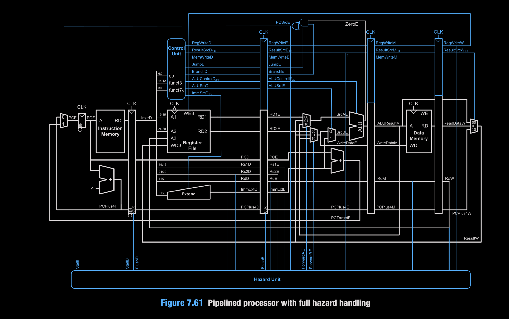
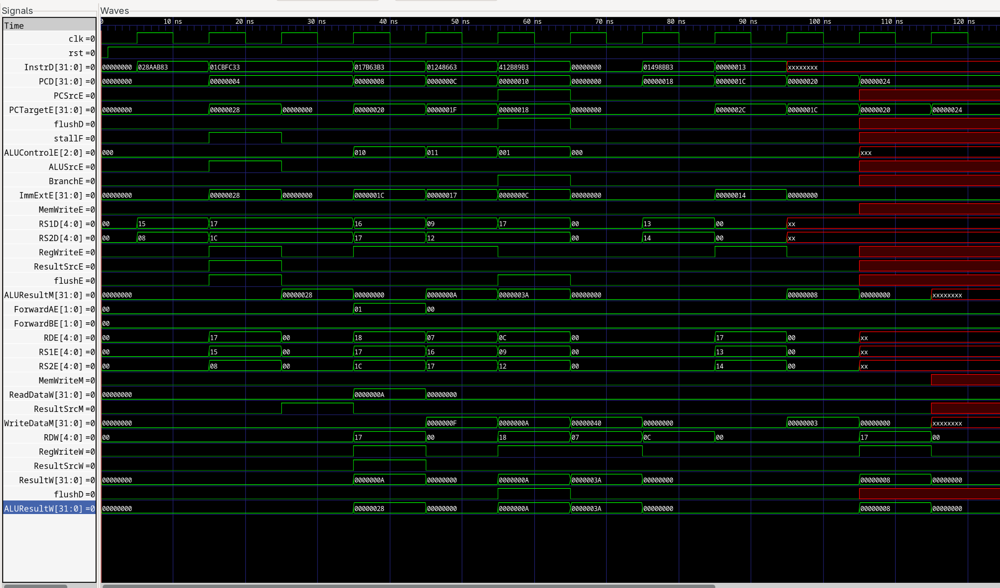
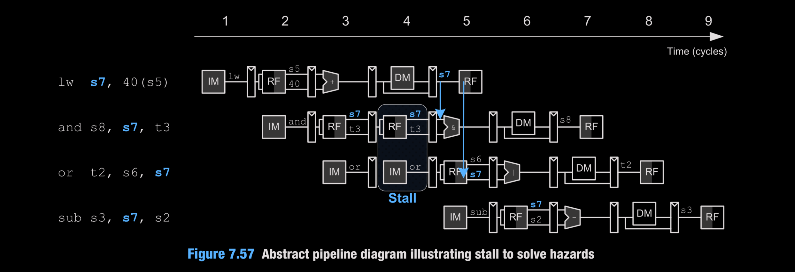
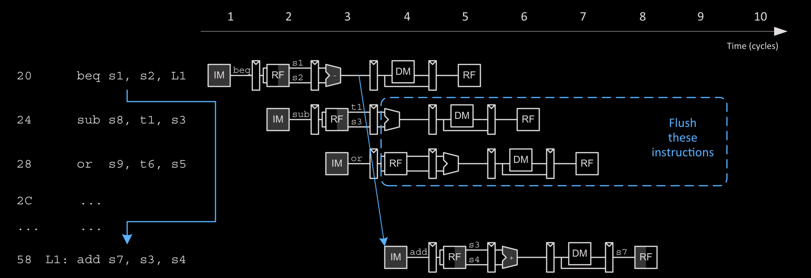

# RISC-V Pipelined Core (Verilog)

A 5-stage RV32I pipeline (IF/ID/EX/MEM/WB) with hazard handling (forwarding, load-use stall, branch flush). This demo runs a small program from hex memories and verifies expected register results. JAL is **not** supported; implemented opcodes: R-type (add/sub/and/or/slt as per ALU decoder), `lw`, `sw`, `beq`.

## Top Architecture


- Stages: instruction memory, register file + immediate gen, ALU/branch target, data memory, writeback mux.
- Hazard unit: forwarding (M/W to EX), load-use stall (holds IF/ID, bubbles ID/EX), branch flush (clears IF/ID and ID/EX on taken branch).
- PC path: selectable between `PC+4` and branch target; PC holds on stall.

## Test Program & Expected Results
Program loaded via `imem.hex`:
1. `lw   s7, 40(s5)`  (load 0xA from DMEM[0x28])
2. `and  s8, s7, t3`  (0xA & 0xF = 0xA)
3. `or   t2, s6, s7`  (0x30 | 0x0A = 0x3A)
4. `beq  s1, s2, L1`  (taken, flushes following two instrs)
5. `sub  s3, s7, s2`  (flushed)
6. `sub  s8, t1, s3`  (flushed)
7. `L1: add s7, s3, s4` (5 + 3 = 8)
8. `nop`

Initial state (from `regs.hex` / `dmem.hex`):
- Registers: s5=0, s6=0x30, s7=0, s8=0, t1=0x2, t2=0, t3=0xF, s1=0x40, s2=0x40, s3=0x5, s4=0x3.
- Data memory: word at byte address 0x28 (index 10) = 0x0000000A; others 0.

Final expected registers (checked by testbench):
- s7 (x23) = 0x00000008
- s8 (x24) = 0x0000000A
- t2 (x7)  = 0x0000003A

Data memory remains unchanged (no stores in this program).

## Pipeline Timeline Highlights

- Load-use stall: after `lw`, `stallF/stallD` assert for one cycle; IF/ID holds, ID/EX bubbles.
- Forwarding: ALU inputs select M or W stage results to avoid extra stalls.
- Branch taken: `PCSrcE` asserts on `beq`; `flushD/flushE` clear the two following instructions; PC redirects to L1.
- NOP padding ensures safe fetch past program end.

## Instruction Flow Illustration

- The two instructions after the taken branch are flushed.
- `add s7, s3, s4` executes from the branch target.

## Branch Illustration

Shows the taken branch redirect and flush of younger instructions.

## Build & Run
Using iverilog/vvp:
```bash
iverilog -g2012 -f files.f -o simv
vvp simv
# optional waveform
gtkwave wave.vcd &
```

## Files of Interest
- `pipeline_top.v` : integrates stages and hazard unit.
- `Microarchitecture/` : stage implementations, memories, hazard logic.
- `ControlUnit/` : main and ALU decoders.
- `imem.hex`, `dmem.hex`, `regs.hex` : program, data, register init.
- `pipeline_top_tb.v` : testbench that preloads memories, runs 20 cycles, and checks final registers.

## Hazard Handling Summary
- Forwarding: EX operands muxed from ID/EX, MEM, or WB (`ForwardAE/BE`).
- Load-use stall: `lwStall` holds PC and IF/ID, inserts bubble into ID/EX.
- Branch flush: `flushD/flushE` clear younger instructions on taken branch.

## Limitations
- No JAL/JALR support (PCPlus4W unused) as of now.
- Memory is simple, word-aligned, with no byte/half accesses.
